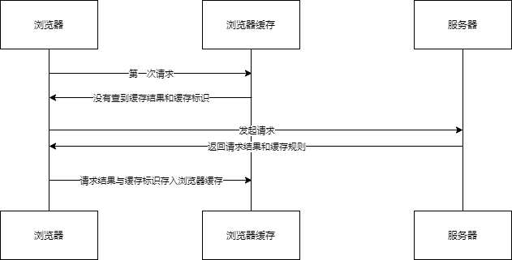

# h1

# h2

# h3

> 引用
> 引用
> 引用

你好**你好**哈哈==marked==这是`code`

https://baidu.com

- list
- list
- list
- list
- list

```javascript
console.log('hello')
```

---



::: info
111
:::

::: note
111
:::

::: tip
111
:::

::: warning
111
:::

::: danger
111
:::


